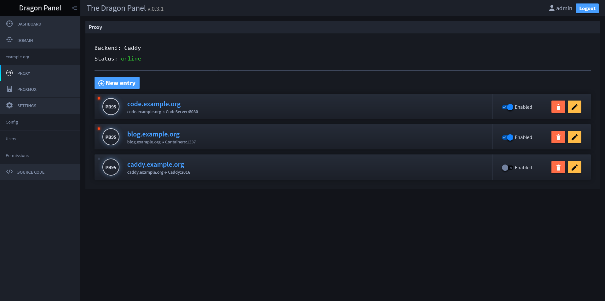

<h1 align="center">The Dragon Panel</h1>

[](https://badges.pufler.dev)
[](https://badges.pufler.dev)

<p align="center"></p>

> Project is in early stage, currently it's almost unusable (well, you can manage domain at least ^^)  
> But ima workin' hard on it

Server administration panel designed for self-host web apps with no efford.
Connecting together:
- Cloudflare - for domain management
- Caddy - for http reverse proxy with auto TLS
- Portainer for managing containers

The goal is to deploy web apps with single click, just like you can do on for example Cloudflare or Vercel.

## Not only the Panel
This is only the beginning, I am planning to create scripts to easily configure Single VPS or Dedicated Server on Proxmox, which will setup everything ya need to self-host cool web apps. Including:
- Caddy
- Portainer
- The Dragon Panel
- Prometheus, Loki, InfluxDB and Grafana
- Backups to S3 storage
- ***Only Proxmox*** intergrating proxmox with Grafana


## Running project
You need to setup 3 env variables
```env
PASSWORD=<PASSWORD_TO_ADMIN_PANEL>
JWT_SECRET=<strong_random_jwt_secret>
ENCRYPTION_KEY=<used_to_encrypt_secrets_from_config_should_be_random_and_strong>
```
Then run
```sh
yarn install
yarn start
```

Go to https://localhost:4200

## How to connect Caddy
I wanted to be smart and expose caddy api via reverse proxy and secure it with basic security.
Unfortunately this causes problem, when I change config caddy wants to reload server. So it waits for
server to close all connections. But server can't close connection until it gets answer from API.
API can't give the answer before it finished it's operation - restarting server because it waits for server to close... ya get it.
Deadlock.

So unfortunately to connect to Caddy right now you have to open caddy admin api to network visible by Dragon Panel.
> ***DO NOT EXPOSE CADDY API TO THE PUBLIC NETWORK, EVERYONE WOULD BE ABLE TO ACCESS IT***
* You can host Dragon Panel on the same machine as caddy, then it will be avaible on localhost
* Expose Caddy Admin API to your private network. ***DO NOT USE 0.0.0.0***. Check IP of private network and expose it there. Then you can connect 2 machines/containers:
    * In proxmox create network bridge and connect it to both machines if you use seperate.
    * When using docker just connect caddy and dragon panel with private network.

Of course you must set url in config. For example localhost:2016

# LICENSE
Copyright 2022 Scuro Guardiano  
Project is licensed under AGPLv3.0, check out LICENSE file for full license text.
